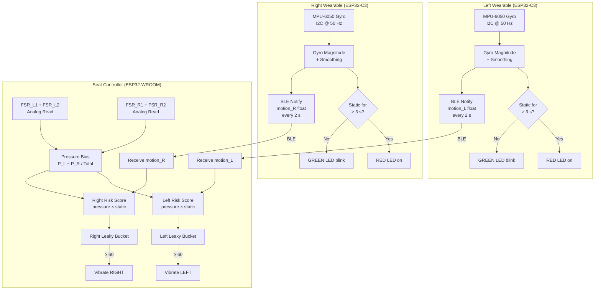

# Bilateral Asymmetric Upper-Limb Load & Immobility Detection System for Seated Users

A wearable IoT system that monitors asymmetric load distribution and upper-limb immobility in seated users and delivers real-time haptic feedback to promote healthier posture and movement.

---

## Table of Contents

- [Overview](#overview)
- [System Architecture](#system-architecture)
- [Hardware Components](#hardware-components)
- [How It Works](#how-it-works)
  - [Wearable Nodes (ESP32-C3)](#wearable-nodes-esp32-c3)
  - [Seat Controller (ESP32-WROOM)](#seat-controller-esp32-wroom)
  - [Leaky Bucket Risk Model](#leaky-bucket-risk-model)
- [BLE Communication](#ble-communication)
- [LED Indicators](#led-indicators)
- [Configuration Parameters](#configuration-parameters)
- [Getting Started](#getting-started)
  - [Prerequisites](#prerequisites)
  - [Wiring](#wiring)
  - [Flashing the Firmware](#flashing-the-firmware)
- [Repository Structure](#repository-structure)

---

## Overview

Prolonged sitting with uneven weight distribution — for example, chronically resting one arm on a desk or armrest — can cause asymmetric musculoskeletal strain and repetitive stress injuries. This system detects two key risk factors simultaneously:

1. **Asymmetric load** — measured by Force Sensitive Resistors (FSRs) embedded in (or under) the seat, comparing left-side versus right-side pressure.
2. **Upper-limb immobility** — measured by gyroscope sensors worn on each shoulder, detecting extended periods without movement.

When both factors combine on the same side (the arm is loaded *and* static), risk accumulates. Once a configurable threshold is crossed, a vibration motor on the affected side alerts the user to shift position or move their arm.

---

## System Architecture

The system is composed of three independent firmware nodes that communicate wirelessly via Bluetooth Low Energy (BLE):

```
┌─────────────────────────────────────────────────────────────────────┐
│                        USER (SEATED)                                │
│                                                                     │
│   ┌───────────────────┐               ┌───────────────────┐        │
│   │  LEFT WEARABLE    │               │  RIGHT WEARABLE   │        │
│   │  (ESP32-C3)       │               │  (ESP32-C3)       │        │
│   │                   │               │                   │        │
│   │  MPU-6050 Gyro    │               │  MPU-6050 Gyro    │        │
│   │  (I2C @ 0x68)     │               │  (I2C @ 0x68)     │        │
│   │                   │               │                   │        │
│   │  BLE Server       │               │  BLE Server       │        │
│   │  "SHOULDER_L"     │               │  "SHOULDER_R"     │        │
│   └────────┬──────────┘               └──────────┬────────┘        │
│            │  BLE Notify (motion float)           │                 │
│            │  every 2 seconds                     │                 │
│            └──────────────────┬──────────────────┘                 │
│                               │                                     │
│                    ┌──────────▼──────────┐                         │
│                    │   SEAT CONTROLLER   │                         │
│                    │   (ESP32-WROOM)     │                         │
│                    │                     │                         │
│                    │  BLE Central Client │                         │
│                    │                     │                         │
│                    │  FSR_L1 + FSR_L2    │  ← Seat pressure left  │
│                    │  FSR_R1 + FSR_R2    │  ← Seat pressure right │
│                    │                     │                         │
│                    │  Leaky Bucket Logic │                         │
│                    │                     │                         │
│                    │  VIB_L  VIB_R       │  → Vibration alerts    │
│                    └─────────────────────┘                         │
└─────────────────────────────────────────────────────────────────────┘
```

### Data Flow



---

## Hardware Components

| Component | Qty | Role |
|---|---|---|
| ESP32-C3 (mini/dev board) | 2 | Left & right wearable shoulder nodes |
| ESP32-WROOM (dev board) | 1 | Seat controller / BLE central |
| MPU-6050 (6-axis IMU) | 2 | Gyroscope sensing on each wearable |
| FSR 402 (or equivalent) | 4 | Seat pressure sensing (2 per side) |
| Vibration motor module | 2 | Haptic alerts on left and right side |
| Red/Green LED | 2 pairs | Status indicators on wearables |
| Resistors / breadboard | — | Pull-downs for FSRs, current limiting for LEDs |
| LiPo battery + charger | 2 | Portable power for wearable nodes |

---

## How It Works

### Wearable Nodes (ESP32-C3)

Each wearable is an identical firmware image (only the BLE device name differs — `SHOULDER_L` vs `SHOULDER_R`) running on an ESP32-C3.

**On startup:**
1. The MPU-6050 is initialised over I2C (SDA → GPIO 8, SCL → GPIO 9).
2. A **200-sample gyroscope calibration** is performed with the device held still, calculating per-axis bias offsets.

**In the main loop (every 20 ms):**
1. Raw gyroscope readings (X, Y, Z) are fetched from register `0x43`.
2. Bias is subtracted and the 3-axis vector **magnitude** is computed:

   ```
   mag = √(gx² + gy² + gz²)   (in °/s)
   ```

3. Magnitude is **exponentially smoothed** for noise resistance:

   ```
   motionSmooth = 0.7 × mag + 0.3 × motionSmooth
   ```

   A rapid-decay rule forces the value to zero quickly when the arm stops:

   ```
   if mag < 0.2:  motionSmooth × 0.5
   if motionSmooth < 0.1:  motionSmooth = 0
   ```

**Static detection (every 100 ms):**
- If `motionSmooth < STATIC_THRESHOLD (10 °/s)` for **3 consecutive seconds**, the arm is classified as **static** (`isStatic = true`).
- Any movement above the threshold immediately resets the static counter.

**BLE broadcast (every 2 s):**
- `motionSmooth` is packed as a raw 4-byte IEEE-754 float and sent via a BLE Notify characteristic.

---

### Seat Controller (ESP32-WROOM)

The seat controller acts as a **BLE Central** — it scans for and connects to both wearables on startup, retrying until both are online.

**Every 200 ms loop iteration:**

1. **Read seat pressure** from four FSR analog pins (two per side):
   ```
   P_L = ADC(FSR_L1) + ADC(FSR_L2)
   P_R = ADC(FSR_R1) + ADC(FSR_R2)
   total = P_L + P_R
   ```

2. **Detect sitting**: `total > MIN_TOTAL_PRESSURE (50 ADC counts)`.

3. **Compute pressure bias** (normalised left-right imbalance, −1 to +1):
   ```
   PressureBias = (P_L − P_R) / total
   ```
   - Positive → left side is heavier
   - Negative → right side is heavier

4. **Compute per-side risk score** combining pressure asymmetry and arm immobility:
   ```
   pressureFactor = clamp((|PressureBias| − 0.2) / 0.5,  0, 1)
   staticFactor   = motion < 2.0  →  1.0  else  clamp(2.0 / motion, 0, 1)

   riskScore = pressureFactor × 2.0  +  staticFactor × 3.0
   ```
   A side only accrues risk if the user is sitting **and** that side has higher pressure.

5. **Leaky bucket** integration (see below).

---

### Leaky Bucket Risk Model

Each side maintains an independent risk accumulator (`bucket_L`, `bucket_R`) in the range `[0, 60]`.

```
bucket += (riskScore − leakRate) × dt

leakRate = BASE_LEAK_RATE (1.0/s)
         + MOVEMENT_LEAK_BOOST (2.0/s)   if motion > 3.0 °/s
```

| Condition | Effect on bucket |
|---|---|
| High pressure bias + static arm | Bucket fills fast (up to 5 units/s) |
| Moving arm | Extra leak drains the bucket faster |
| Normal movement + even pressure | Bucket slowly drains to zero |
| Bucket reaches 60 | Vibration alert fires, bucket reset to 30 |

This model provides **hysteresis** — brief posture corrections reduce the bucket but do not immediately silence the system if risk has been building for a long time.

---

## BLE Communication

All three devices share the same UUIDs:

| Parameter | Value |
|---|---|
| Service UUID | `12345678-1234-1234-1234-1234567890ab` |
| Characteristic UUID | `abcd1234-5678-1234-5678-abcdef123456` |
| Left wearable name | `SHOULDER_L` |
| Right wearable name | `SHOULDER_R` |
| Payload | 4-byte little-endian IEEE-754 float (`motionSmooth`) |
| Notify interval | 2000 ms |

The seat controller registers for notifications on both characteristics. If no BLE packet is received from either wearable within **5 seconds**, the corresponding motion value is forced to zero (treated as static) to fail safe.

---

## LED Indicators

Each wearable has two LEDs (GPIO 5 = Red, GPIO 6 = Green):

| LED state | Meaning |
|---|---|
| 🟢 Green blinking (500 ms) | Arm is moving — normal activity |
| 🔴 Red solid | Arm has been static for ≥ 3 seconds |

---

## Configuration Parameters

### Wearable nodes (`Left controller` / `Right Wearable`)

| Parameter | Default | Description |
|---|---|---|
| `SAMPLE_INTERVAL` | 20 ms | Gyro sampling rate (50 Hz) |
| `BLE_INTERVAL` | 2000 ms | BLE notification interval |
| `MOTION_CHECK_INTERVAL` | 100 ms | Static detection check rate |
| `STATIC_THRESHOLD` | 10 °/s | Smoothed magnitude below which arm is "static" |
| Calibration samples | 200 | Samples averaged for gyro bias offset |
| Static hold time | 3000 ms | Duration below threshold before `isStatic` triggers |

### Seat controller (`WROOM controller`)

| Parameter | Default | Description |
|---|---|---|
| `LOOP_INTERVAL` | 200 ms | Main processing loop rate |
| `BLE_TIMEOUT` | 5000 ms | Max time before wearable data is considered stale |
| `PRESSURE_THRESHOLD` | 0.2 | Minimum normalised bias to count as asymmetric |
| `MOTION_STATIC_THRESHOLD` | 2.0 °/s | Motion below this is "static" at the seat controller |
| `MIN_TOTAL_PRESSURE` | 50 | ADC sum threshold to confirm user is seated |
| `BUCKET_MAX` | 60.0 | Maximum bucket accumulator value |
| `TRIGGER_LEVEL` | 60.0 | Bucket level that fires a vibration alert |
| `BASE_LEAK_RATE` | 1.0 /s | Baseline bucket drain rate |
| `PRESSURE_WEIGHT` | 2.0 | Risk contribution from pressure bias |
| `STATIC_WEIGHT` | 3.0 | Risk contribution from arm immobility |
| `MOVEMENT_LEAK_BOOST` | 2.0 /s | Extra drain when arm is actively moving |

---

## Getting Started

### Prerequisites

- [Arduino IDE](https://www.arduino.cc/en/software) ≥ 2.x or [PlatformIO](https://platformio.org/)
- Arduino ESP32 board package (`espressif/arduino-esp32` ≥ 2.0)
- Libraries (all bundled with the ESP32 Arduino core):
  - `Wire` (I2C)
  - `BLEDevice` / `BLEUtils` / `BLEServer` / `BLEClient` / `BLE2902`

### Wiring

#### Wearable Node (each, ESP32-C3)

| MPU-6050 Pin | ESP32-C3 Pin |
|---|---|
| VCC | 3.3 V |
| GND | GND |
| SDA | GPIO 8 |
| SCL | GPIO 9 |
| AD0 | GND (address 0x68) |

| LED | ESP32-C3 Pin |
|---|---|
| Red LED (+ resistor) | GPIO 5 |
| Green LED (+ resistor) | GPIO 6 |

#### Seat Controller (ESP32-WROOM)

| Component | ESP32-WROOM Pin |
|---|---|
| FSR left 1 | GPIO 34 (ADC) |
| FSR left 2 | GPIO 35 (ADC) |
| FSR right 1 | GPIO 32 (ADC) |
| FSR right 2 | GPIO 33 (ADC) |
| Vibration motor LEFT | GPIO 25 |
| Vibration motor RIGHT | GPIO 26 |

> **Note:** FSRs should be wired as voltage dividers (FSR + pull-down resistor to GND, junction to ADC pin). A 10 kΩ pull-down is a common starting value.

### Flashing the Firmware

1. Open each source file in Arduino IDE and select the correct board:
   - `Left controller` / `Right Wearable` → **ESP32C3 Dev Module**
   - `WROOM controller` → **ESP32 Dev Module** (WROOM)

2. For the **left wearable**, ensure:
   ```cpp
   #define DEVICE_NAME "SHOULDER_L"
   ```
   For the **right wearable**, ensure:
   ```cpp
   #define DEVICE_NAME "SHOULDER_R"
   ```

3. Flash each board and open the Serial Monitor at **115200 baud** to verify calibration and BLE connection status.

4. **Power on wearables first**, then the seat controller. The seat controller will scan and connect to both `SHOULDER_L` and `SHOULDER_R` automatically.

5. Once both wearables are connected, the Serial Monitor on the seat controller will print:
   ```
   Both wearables connected. Starting logic.
   ```
   Followed by live telemetry every 200 ms:
   ```
   Bias: 0.412 | L: 3.21 | R: 0.00 | BL: 12.4 | BR:  0.0
   ```

---

## Repository Structure

```
.
├── Left controller        # ESP32-C3 firmware for the left shoulder wearable
├── Right Wearable         # ESP32-C3 firmware for the right shoulder wearable
└── WROOM controller       # ESP32-WROOM firmware for the seat controller
```

Each file is a self-contained Arduino `.ino`-compatible C++ sketch.

---

## License

This project is provided for research and educational purposes. See repository owner for licensing details.
