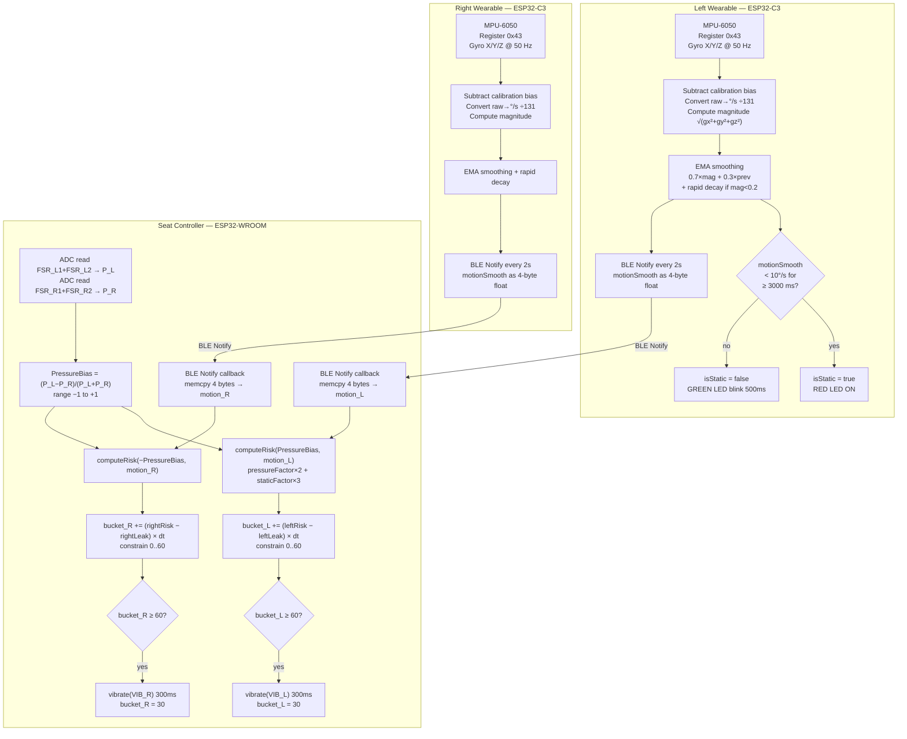

# Bilateral Asymmetric Upper-Limb Load & Immobility Detection System for Seated Users

A three-node embedded system that concurrently monitors seat pressure asymmetry and bilateral upper-limb immobility in seated users, using a leaky-bucket risk integrator to trigger side-specific haptic alerts when prolonged asymmetric loading is detected.

---

## Table of Contents

- [Problem Statement](#problem-statement)
- [System Architecture](#system-architecture)
- [Node 1 & 2 — Wearable Shoulder Nodes (`Left controller` / `Right Wearable`)](#node-1--2--wearable-shoulder-nodes)
  - [Hardware & Pin Mapping](#wearable-hardware--pin-mapping)
  - [MPU-6050 Initialisation](#mpu-6050-initialisation-setupmpu)
  - [Gyroscope Calibration](#gyroscope-calibration-calibrategyro)
  - [Motion Magnitude Computation](#motion-magnitude-computation-readgyromagnitude)
  - [Exponential Smoothing & Rapid Decay](#exponential-smoothing--rapid-decay)
  - [Static Arm Detection](#static-arm-detection)
  - [LED State Machine](#led-state-machine-updateleds)
  - [BLE Server & Notification](#ble-server--notification)
  - [Wearable Timing Summary](#wearable-timing-summary)
- [Node 3 — Seat Controller (`WROOM controller`)](#node-3--seat-controller)
  - [Hardware & Pin Mapping](#seat-controller-hardware--pin-mapping)
  - [BLE Central Connection](#ble-central-connection-connectsingle)
  - [FSR Pressure Reading](#fsr-pressure-reading)
  - [Pressure Bias Normalisation](#pressure-bias-normalisation)
  - [Risk Score Computation (`computeRisk`)](#risk-score-computation-computerisk)
  - [Leaky Bucket Integrator](#leaky-bucket-integrator)
  - [Vibration Alert & Bucket Reset](#vibration-alert--bucket-reset)
  - [BLE Stale Data Handling](#ble-stale-data-handling)
  - [Serial Telemetry](#serial-telemetry)
- [End-to-End Data Flow](#end-to-end-data-flow)
- [BLE Protocol Specification](#ble-protocol-specification)
- [All Configuration Constants](#all-configuration-constants)
- [Getting Started](#getting-started)
  - [Prerequisites](#prerequisites)
  - [Wiring](#wiring)
  - [Flashing Order](#flashing-order)
- [Repository Structure](#repository-structure)

---

## Problem Statement

Seated workers who habitually rest one arm on a desk or armrest apply a chronic asymmetric load through the shoulder girdle and lumbar spine. When that arm is also immobile for long periods, the risk of musculoskeletal strain compounds. This system detects both conditions simultaneously — asymmetric seat pressure as a proxy for lateralised upper-body loading, and gyroscope-derived motion as a direct measure of arm immobility — and fuses them into a time-integrated risk score that triggers haptic feedback before injury thresholds are reached.

---

## System Architecture

```
╔══════════════════════════════════════════════════════════════════╗
║                        SEATED USER                              ║
║                                                                  ║
║  ┌───────────────────────┐       ┌───────────────────────┐      ║
║  │   LEFT WEARABLE        │       │   RIGHT WEARABLE       │      ║
║  │   ESP32-C3             │       │   ESP32-C3             │      ║
║  │                        │       │                        │      ║
║  │  MPU-6050 (I2C 0x68)   │       │  MPU-6050 (I2C 0x68)   │      ║
║  │  SDA→GPIO8  SCL→GPIO9  │       │  SDA→GPIO8  SCL→GPIO9  │      ║
║  │                        │       │                        │      ║
║  │  Gyro @ 50 Hz          │       │  Gyro @ 50 Hz          │      ║
║  │  EMA smoothing         │       │  EMA smoothing         │      ║
║  │  Static detection      │       │  Static detection      │      ║
║  │                        │       │                        │      ║
║  │  RED  LED → GPIO 5     │       │  RED  LED → GPIO 5     │      ║
║  │  GREEN LED → GPIO 6    │       │  GREEN LED → GPIO 6    │      ║
║  │                        │       │                        │      ║
║  │  BLE SERVER            │       │  BLE SERVER            │      ║
║  │  Name: "SHOULDER_L"    │       │  Name: "SHOULDER_R"    │      ║
║  │  Notify every 2 s      │       │  Notify every 2 s      │      ║
║  └──────────┬─────────────┘       └─────────────┬──────────┘      ║
║             │   4-byte IEEE-754 float             │                 ║
║             │   (motionSmooth °/s)                │                 ║
║             └─────────────────┬───────────────────┘                ║
║                               │ BLE Notify                         ║
║                    ┌──────────▼────────────┐                       ║
║                    │   SEAT CONTROLLER      │                       ║
║                    │   ESP32-WROOM          │                       ║
║                    │                        │                       ║
║                    │  BLE CENTRAL CLIENT    │                       ║
║                    │  (connects to both)    │                       ║
║                    │                        │                       ║
║                    │  FSR_L1 → GPIO 34 ─┐  │                       ║
║                    │  FSR_L2 → GPIO 35 ─┴→ P_L                     ║
║                    │  FSR_R1 → GPIO 32 ─┐  │                       ║
║                    │  FSR_R2 → GPIO 33 ─┴→ P_R                     ║
║                    │                        │                       ║
║                    │  Pressure Bias         │                       ║
║                    │  Risk Score            │                       ║
║                    │  Leaky Bucket ×2       │                       ║
║                    │                        │                       ║
║                    │  VIB_L ← GPIO 25       │ ← 300 ms pulse       ║
║                    │  VIB_R ← GPIO 26       │ ← 300 ms pulse       ║
║                    └────────────────────────┘                       ║
╚══════════════════════════════════════════════════════════════════╝
```

### End-to-End Data Flow



---

## Node 1 & 2 — Wearable Shoulder Nodes

**Files:** `Left controller` (device name `SHOULDER_L`) and `Right Wearable` (device name `SHOULDER_R`).

The two files are functionally identical — the only difference is the `DEVICE_NAME` define. Each runs on an **ESP32-C3** and acts as a BLE GATT Server that continuously publishes a smoothed gyroscopic motion index.

### Wearable Hardware & Pin Mapping

| Signal | ESP32-C3 GPIO | Notes |
|---|---|---|
| I2C SDA (MPU-6050) | GPIO 8 | `Wire.begin(8, 9)` |
| I2C SCL (MPU-6050) | GPIO 9 | |
| Red LED | GPIO 5 | Static alarm indicator |
| Green LED | GPIO 6 | Active / heartbeat blink |

MPU-6050 I2C address: **0x68** (AD0 pin pulled low).

---

### MPU-6050 Initialisation (`setupMPU`)

```cpp
Wire.begin(I2C_SDA, I2C_SCL);          // start I2C on GPIO 8/9
Wire.beginTransmission(MPU_ADDR);       // address 0x68
Wire.write(0x6B);                       // PWR_MGMT_1 register
Wire.write(0);                          // clear sleep bit → wake device
Wire.endTransmission(true);
```

Register `0x6B` is the MPU-6050 **Power Management 1** register. On power-up the device is in sleep mode by default; writing `0x00` clears the `SLEEP` bit and starts the internal oscillator. No additional configuration is needed because the default gyroscope full-scale range of **±250 °/s** is used, giving a sensitivity of **131 LSB per °/s**.

---

### Gyroscope Calibration (`calibrateGyro`)

Called once at startup with the device held perfectly still. The function collects **200 raw gyroscope samples** at 5 ms intervals (1 second total) by reading 6 bytes starting at register `0x43` (`GYRO_XOUT_H`):

```
Bytes 0-1 → int16_t gx   (GYRO_XOUT_H / GYRO_XOUT_L)
Bytes 2-3 → int16_t gy   (GYRO_YOUT_H / GYRO_YOUT_L)
Bytes 4-5 → int16_t gz   (GYRO_ZOUT_H / GYRO_ZOUT_L)
```

The mean raw value for each axis is divided by 131.0 to convert to °/s:

```
biasX = (sumX / 200) / 131.0
biasY = (sumY / 200) / 131.0
biasZ = (sumZ / 200) / 131.0
```

These three floats represent the gyroscope's zero-rate offset in °/s and are subtracted from every subsequent reading to remove sensor drift.

> **Important:** The device must not move during calibration. Any motion contaminates the bias estimate and will raise the effective noise floor, causing false "moving" readings.

---

### Motion Magnitude Computation (`readGyroMagnitude`)

Also reads 6 bytes from register `0x43`. The raw int16 values are converted to °/s by dividing by 131.0 and then the calibration bias is subtracted per axis:

```cpp
float gxf = (int16_t)(raw_high << 8 | raw_low) / 131.0 - biasX;
float gyf = ...
float gzf = ...
```

The scalar **Euclidean magnitude** of the angular velocity vector is returned:

```
mag = √(gxf² + gyf² + gzf²)   [°/s]
```

This magnitude is direction-agnostic — it captures total rotational activity regardless of which axis moves. Returns 0 immediately if fewer than 6 bytes are available on the I2C bus.

---

### Exponential Smoothing & Rapid Decay

Executed inside the main loop every **20 ms** (50 Hz):

```cpp
// Weighted EMA — 70% new sample, 30% history
motionSmooth = 0.7 * mag + 0.3 * motionSmooth;

// Rapid decay: halve the accumulator each sample when arm is still
if (mag < 0.2)
    motionSmooth *= 0.5;

// Hard floor: snap to zero to prevent drift accumulation
if (motionSmooth < 0.1)
    motionSmooth = 0;
```

The **0.7/0.3 EMA** provides fast rise (arm starts moving → value climbs within ~3 samples / 60 ms) while still suppressing single-sample noise spikes.

The **rapid decay** rule is critical: without it, the EMA's 0.3 memory factor would keep `motionSmooth` elevated for several seconds after the arm stops, delaying static detection. The halving at each 20 ms step when the raw magnitude is near zero means the accumulator collapses to the hard floor in roughly `log₂(motionSmooth / 0.1)` samples — typically under 200 ms for a typical resting value.

---

### Static Arm Detection

Checked every **100 ms**:

```
if motionSmooth < 10 °/s (STATIC_THRESHOLD):
    if staticStartTime == 0: record start
    if elapsed ≥ 3000 ms: isStatic = true
else:
    staticStartTime = 0
    isStatic = false
```

The 3-second debounce prevents brief pauses in movement from triggering a false alarm. As soon as `motionSmooth` rises above 10 °/s the timer resets instantly.

`isStatic` is a local flag used only by the LED logic on the wearable. The seat controller derives its own static assessment from the raw `motionSmooth` value it receives over BLE.

---

### LED State Machine (`updateLEDs`)

Called every loop iteration (no fixed interval):

| `isStatic` | Red LED | Green LED |
|---|---|---|
| `true` | HIGH (solid on) | LOW (off) |
| `false` | LOW (off) | Toggles every 500 ms |

The green blink provides a live heartbeat — the user and developer can see at a glance that the firmware is running and the arm is considered active.

---

### BLE Server & Notification

**`setupBLE()`** configures the ESP32-C3 as a GATT server:

1. `BLEDevice::init(DEVICE_NAME)` — sets the advertised device name (`"SHOULDER_L"` or `"SHOULDER_R"`).
2. Creates a single Service (`SERVICE_UUID`) and a single Characteristic (`CHARACTERISTIC_UUID`) with the `PROPERTY_NOTIFY` flag only — the characteristic cannot be read or written by a client, only subscribed to.
3. Attaches a **BLE2902 descriptor** (Client Characteristic Configuration Descriptor) which is mandatory for BLE notifications — the central must write `0x0001` to this descriptor to enable notifications, and the ESP32 Arduino BLE library handles this automatically when the descriptor is present.
4. Starts advertising the service UUID so the seat controller can discover it by UUID during scanning.

**Notification (every 2000 ms):**

```cpp
uint8_t payload[4];
memcpy(payload, &motionSmooth, 4);   // raw IEEE-754 float, little-endian
pCharacteristic->setValue(payload, 4);
pCharacteristic->notify();
```

`motionSmooth` is transmitted as a raw 4-byte IEEE-754 single-precision float. The receiving side reconstructs it identically with `memcpy(&motion_L, data, 4)`.

---

### Wearable Timing Summary

| Task | Interval | Mechanism |
|---|---|---|
| Gyro sample + EMA update | 20 ms (50 Hz) | `millis()` delta |
| Static detection check | 100 ms | `millis()` delta |
| LED update | Every loop pass | `millis()` delta inside `updateLEDs` |
| BLE notify | 2000 ms | `millis()` delta |

All timing uses non-blocking `millis()` comparisons — there are no `delay()` calls in the main loop, so all four tasks run concurrently without blocking each other.

---

## Node 3 — Seat Controller

**File:** `WROOM controller`  
**Hardware:** ESP32-WROOM-32 (or equivalent ESP32 with exposed ADC pins)

The seat controller is the system's **decision-making hub**. It acts as a BLE Central that receives motion data from both wearables, reads four FSR sensors to quantify seat pressure imbalance, fuses the two inputs into a side-specific risk score, and integrates that score over time using independent leaky-bucket accumulators to trigger vibration alerts.

### Seat Controller Hardware & Pin Mapping

| Signal | GPIO | ADC Channel | Notes |
|---|---|---|---|
| FSR left, sensor 1 | 34 | ADC1_CH6 | Input-only pin, no internal pull-up |
| FSR left, sensor 2 | 35 | ADC1_CH7 | Input-only pin |
| FSR right, sensor 1 | 32 | ADC1_CH4 | |
| FSR right, sensor 2 | 33 | ADC1_CH5 | |
| Left vibration motor | 25 | — | Digital output, active-HIGH 300 ms |
| Right vibration motor | 26 | — | Digital output, active-HIGH 300 ms |

> GPIO 34 and 35 are input-only on the ESP32 — they have no internal pull-up/pull-down. Wire FSRs as a voltage divider: FSR between VCC and the pin, 10 kΩ pull-down resistor between the pin and GND.

---

### BLE Central Connection (`connectSingle`)

`connectSingle(name, &client, &characteristic, callback)` is called separately for each wearable and wraps the full GATT connection sequence:

1. **Active BLE scan** for 3 seconds: `scan->setActiveScan(true); scan->start(3)`. Active scanning requests scan response packets, which include the full device name.
2. Iterates the scan results and matches `dev.getName() == name` — this is an exact string match against `"SHOULDER_L"` or `"SHOULDER_R"`.
3. Creates a `BLEClient`, calls `client->connect(&dev)`.
4. Retrieves the remote Service by UUID, then the remote Characteristic by UUID.
5. Registers `notifyCallback_L` or `notifyCallback_R` via `characteristic->registerForNotify(cb)` — the library writes `0x0001` to the BLE2902 descriptor on the remote device, enabling notifications.
6. Returns `true` on success, `false` on any failure.

The `setup()` function loops calling `connectSingle` for whichever side is not yet connected, with a 2-second retry delay, until **both** wearables are connected before any processing begins:

```cpp
while (!connected_L || !connected_R) {
    if (!connected_L) connected_L = connectSingle("SHOULDER_L", ...);
    if (!connected_R) connected_R = connectSingle("SHOULDER_R", ...);
    if (!connected_L || !connected_R) delay(2000);
}
```

---

### FSR Pressure Reading

Two FSRs are placed under each seat cushion half. Their ADC values are summed per side:

```cpp
float P_L = analogRead(FSR_L1) + analogRead(FSR_L2);   // GPIO 34 + 35
float P_R = analogRead(FSR_R1) + analogRead(FSR_R2);   // GPIO 32 + 33
float total = P_L + P_R;
```

Using two sensors per side rather than one provides better spatial coverage of the seat pan and reduces the effect of a single sensor's nonlinearity or positioning error.

**Sitting detection:** `total > 50` ADC counts. Below this threshold the system treats the user as absent and suppresses all risk accumulation (both risk scores are forced to 0 regardless of pressure bias or motion data).

---

### Pressure Bias Normalisation

```cpp
float PressureBias = 0;
if (total > MIN_TOTAL_PRESSURE)
    PressureBias = (P_L - P_R) / total;
```

`PressureBias` is a normalised value in **[−1, +1]**:

| Value | Meaning |
|---|---|
| +1.0 | All weight on the left, none on the right |
| 0.0 | Perfectly symmetric |
| −1.0 | All weight on the right, none on the left |

Normalising by `total` makes the bias independent of the user's body weight — a 50 kg user sitting asymmetrically produces the same bias value as a 100 kg user in the same posture.

---

### Risk Score Computation (`computeRisk`)

```cpp
float computeRisk(float pressureBias, float motion) {
    float pressureFactor = max(0.0, pressureBias - PRESSURE_THRESHOLD);
    pressureFactor = constrain(pressureFactor / 0.5, 0, 1);

    float staticFactor = (motion < MOTION_STATIC_THRESHOLD) ? 1.0
                       : constrain(MOTION_STATIC_THRESHOLD / motion, 0, 1);

    return (pressureFactor * PRESSURE_WEIGHT) + (staticFactor * STATIC_WEIGHT);
}
```

**`pressureFactor`** — a dead-zone then linear ramp:
- `pressureBias < 0.2` → pressureFactor = 0 (ignore small natural imbalances)
- `pressureBias` between 0.2 and 0.7 → linear ramp from 0 to 1
- `pressureBias ≥ 0.7` → pressureFactor saturates at 1

**`staticFactor`** — inversely proportional to motion:
- `motion < 2.0 °/s` → staticFactor = 1.0 (fully static)
- `motion ≥ 2.0 °/s` → `staticFactor = 2.0 / motion` (decreases hyperbolically)
- At 10 °/s → staticFactor ≈ 0.2; at 20 °/s → staticFactor ≈ 0.1

**Risk score** is the weighted sum:
```
riskScore = pressureFactor × 2.0  +  staticFactor × 3.0
```

| Scenario | pressureFactor | staticFactor | riskScore |
|---|---|---|---|
| Even pressure, active arm | 0 | ~0 | ~0 |
| Slight bias (0.3), active arm | 0.2 | 0.1 | 0.7 |
| High bias (0.7), static arm | 1.0 | 1.0 | **5.0** (max) |
| No bias, static arm | 0 | 1.0 | 3.0 |
| High bias, active arm (10°/s) | 1.0 | 0.2 | 2.6 |

Only the **loaded side** computes a non-zero risk. The left side only accrues risk when `PressureBias > 0` (left heavier); the right side only when `PressureBias < 0` (right heavier). For the right side, `computeRisk` is called with `-PressureBias` so the same function is reused symmetrically.

---

### Leaky Bucket Integrator

Each side maintains an independent float accumulator (`bucket_L`, `bucket_R`) clamped to `[0, BUCKET_MAX=60]`. The bucket is updated every 200 ms loop cycle using **continuous-time integration**:

```
dt = elapsed_ms / 1000.0   (in seconds)

leakRate = BASE_LEAK_RATE (1.0/s)
         + MOVEMENT_LEAK_BOOST (2.0/s)   if motion > MOTION_STATIC_THRESHOLD × 1.5 (3.0°/s)

bucket += (riskScore − leakRate) × dt
bucket = constrain(bucket, 0, 60)
```

The leak rate represents passive risk dissipation — even with no active movement, risk leaks away at 1 unit/s. The `MOVEMENT_LEAK_BOOST` adds an extra 2 units/s of drain when the arm is clearly moving (`motion > 3.0 °/s`), accelerating recovery when the user actively shifts position.

**Fill vs drain analysis:**

| Condition | Net rate (units/s) | Time to fill from 0 |
|---|---|---|
| Max risk (score=5.0) + static arm | +4.0 | 15 s |
| Moderate risk (score=3.0) + static | +2.0 | 30 s |
| Low risk (score=1.5) + static | +0.5 | 120 s |
| No risk + active arm | −3.0 | drains in ~20 s from full |
| No risk + still arm | −1.0 | drains in ~60 s from full |

The **dt-based integration** ensures the bucket accumulates consistently regardless of minor jitter in loop timing.

---

### Vibration Alert & Bucket Reset

```cpp
if (bucket_L >= TRIGGER_LEVEL) {   // 60.0
    vibrate(VIB_L);                // GPIO 25 HIGH for 300 ms
    bucket_L = BUCKET_MAX * 0.5;  // reset to 30, not 0
}
```

**Partial reset to 30 (not 0):** If the root cause (asymmetric posture + static arm) persists, the bucket will refill and trigger again relatively quickly. Resetting to 0 would give a false sense that the problem is resolved. The 50% reset means the next alert fires in roughly half the original fill time if nothing changes.

**`vibrate(pin)` implementation:**
```cpp
void vibrate(int pin) {
    digitalWrite(pin, HIGH);
    delay(300);          // blocking 300 ms pulse
    digitalWrite(pin, LOW);
}
```

The 300 ms blocking delay in `vibrate()` does pause the main loop. During this window the BLE notify callbacks still fire (BLE is interrupt-driven), so `motion_L` and `motion_R` remain up to date. The FSR readings taken immediately after the delay will be current within 300 ms.

---

### BLE Stale Data Handling

The notify callbacks record the timestamp of each received packet:

```cpp
void notifyCallback_L(..., uint8_t* data, size_t length, bool) {
    if (length == 4) {
        memcpy(&motion_L, data, 4);
        lastPacket_L = millis();
    }
}
```

At the start of each loop:

```cpp
if (now - lastPacket_L > BLE_TIMEOUT)  motion_L = 0;
if (now - lastPacket_R > BLE_TIMEOUT)  motion_R = 0;
```

If no packet has been received from a wearable within **5 seconds**, `motion_L` or `motion_R` is forced to 0 — equivalent to treating the arm as fully static. This **fail-safe behaviour** means a dropped BLE connection or out-of-range wearable errs on the side of overestimating risk rather than silently ignoring a potentially immobile arm.

---

### Serial Telemetry

Every 200 ms the controller prints a single diagnostic line:

```
Bias: 0.412 | L:  3.21 | R:  0.00 | BL: 14.2 | BR:  0.0
```

| Field | Variable | Unit |
|---|---|---|
| `Bias` | `PressureBias` | normalised [−1, +1] |
| `L` | `motion_L` | °/s (from left wearable) |
| `R` | `motion_R` | °/s (from right wearable) |
| `BL` | `bucket_L` | risk units [0–60] |
| `BR` | `bucket_R` | risk units [0–60] |

When a trigger fires, a separate line is printed: `LEFT TRIGGER` or `RIGHT TRIGGER`.

---

## BLE Protocol Specification

All three nodes share a single Service and Characteristic UUID:

| Parameter | Value |
|---|---|
| Service UUID | `12345678-1234-1234-1234-1234567890ab` |
| Characteristic UUID | `abcd1234-5678-1234-5678-abcdef123456` |
| Characteristic properties | NOTIFY only |
| Descriptor | BLE2902 (CCCD) — enables client notification subscription |
| Left wearable advertised name | `SHOULDER_L` |
| Right wearable advertised name | `SHOULDER_R` |
| Payload format | 4 bytes, IEEE-754 single-precision float, little-endian |
| Payload contents | `motionSmooth` (smoothed gyro magnitude in °/s) |
| Notification interval | 2000 ms |
| Stale timeout (seat controller) | 5000 ms → motion forced to 0 |

The seat controller connects to each wearable individually (`connectSingle` is called sequentially, not simultaneously). Each wearable maintains an independent GATT server. There is no direct communication between the two wearables.

---

## All Configuration Constants

### Wearable nodes (`Left controller` / `Right Wearable`)

| Constant | Value | Meaning |
|---|---|---|
| `DEVICE_NAME` | `"SHOULDER_L"` / `"SHOULDER_R"` | BLE advertised name |
| `MPU_ADDR` | `0x68` | MPU-6050 I2C address (AD0=GND) |
| `I2C_SDA` | `8` | GPIO for I2C data |
| `I2C_SCL` | `9` | GPIO for I2C clock |
| `LED_RED` | `5` | GPIO for red LED |
| `LED_GREEN` | `6` | GPIO for green LED |
| `SAMPLE_INTERVAL` | `20` ms | Gyro polling rate = 50 Hz |
| `BLE_INTERVAL` | `2000` ms | BLE notification rate |
| `MOTION_CHECK_INTERVAL` | `100` ms | Static detection evaluation rate |
| `STATIC_THRESHOLD` | `10` °/s | Smoothed magnitude threshold for "arm static" |
| Calibration samples | `200` | 200 × 5 ms = 1 s calibration window |
| EMA alpha | `0.7` | New-sample weight in exponential moving average |
| Rapid decay divisor | `0.5` | Halves `motionSmooth` each sample when mag < 0.2 |
| Static hold time | `3000` ms | Consecutive ms below threshold before `isStatic` = true |
| LED blink period | `500` ms | Green LED toggle interval |

### Seat controller (`WROOM controller`)

| Constant | Value | Meaning |
|---|---|---|
| `FSR_L1` / `FSR_L2` | `34`, `35` | Left seat FSR ADC pins |
| `FSR_R1` / `FSR_R2` | `32`, `33` | Right seat FSR ADC pins |
| `VIB_L` / `VIB_R` | `25`, `26` | Vibration motor output pins |
| `LOOP_INTERVAL` | `200` ms | Main processing loop rate (5 Hz) |
| `BLE_TIMEOUT` | `5000` ms | Age limit for wearable data before stale fallback |
| `PRESSURE_THRESHOLD` | `0.2` | Dead zone — biases below this are ignored |
| `MOTION_STATIC_THRESHOLD` | `2.0` °/s | Threshold for "arm static" in risk computation |
| `MIN_TOTAL_PRESSURE` | `50` ADC counts | Sitting detection threshold |
| `BUCKET_MAX` | `60.0` | Maximum bucket accumulator value |
| `TRIGGER_LEVEL` | `60.0` | Bucket value that fires a vibration alert |
| `BASE_LEAK_RATE` | `1.0` /s | Passive bucket drain rate |
| `PRESSURE_WEIGHT` | `2.0` | Risk multiplier for pressure asymmetry |
| `STATIC_WEIGHT` | `3.0` | Risk multiplier for arm immobility |
| `MOVEMENT_LEAK_BOOST` | `2.0` /s | Additional leak when arm is actively moving |
| Movement boost threshold | `MOTION_STATIC_THRESHOLD × 1.5 = 3.0` °/s | Motion level to trigger extra leak |
| Vibration pulse width | `300` ms | Duration of vibration motor activation |
| Post-trigger bucket value | `BUCKET_MAX × 0.5 = 30.0` | Partial reset after alert fires |

---

## Getting Started

### Prerequisites

- [Arduino IDE](https://www.arduino.cc/en/software) ≥ 2.x  
- ESP32 Arduino board package: `espressif/arduino-esp32` ≥ 2.0 (installed via Boards Manager)  
- No additional libraries required — `Wire`, `BLEDevice`, `BLEUtils`, `BLEServer`, `BLEClient`, and `BLE2902` are all included in the ESP32 Arduino core.

### Wiring

#### Each Wearable Node (ESP32-C3)

```
MPU-6050                 ESP32-C3
─────────────────────────────────
VCC         ──────────── 3.3V
GND         ──────────── GND
SDA         ──────────── GPIO 8
SCL         ──────────── GPIO 9
AD0         ──────────── GND       ← sets I2C address to 0x68

Red LED (+) ──[330Ω]──── GPIO 5
Red LED (–) ──────────── GND

Green LED (+) ─[330Ω]─── GPIO 6
Green LED (–) ─────────── GND
```

#### Seat Controller (ESP32-WROOM)

```
Left FSR 1:   FSR between 3.3V and GPIO 34; 10kΩ from GPIO 34 to GND
Left FSR 2:   FSR between 3.3V and GPIO 35; 10kΩ from GPIO 35 to GND
Right FSR 1:  FSR between 3.3V and GPIO 32; 10kΩ from GPIO 32 to GND
Right FSR 2:  FSR between 3.3V and GPIO 33; 10kΩ from GPIO 33 to GND

Vibration motor L: GPIO 25 → transistor base → motor between VCC and collector
Vibration motor R: GPIO 26 → transistor base → motor between VCC and collector
```

> Drive vibration motors through an NPN transistor (e.g. 2N2222) or MOSFET — the ESP32 GPIO cannot source enough current directly.

### Flashing Order

1. **Open `Left controller` in Arduino IDE.** Select board: `ESP32C3 Dev Module`. Verify `DEVICE_NAME` is `"SHOULDER_L"`. Flash.
2. **Open `Right Wearable` in Arduino IDE.** Select board: `ESP32C3 Dev Module`. Verify `DEVICE_NAME` is `"SHOULDER_R"`. Flash.
3. **Open `WROOM controller` in Arduino IDE.** Select board: `ESP32 Dev Module`. Flash.
4. **Power on wearables first.** Each wearable will calibrate its gyro (keep still for ~1 second), then begin advertising over BLE.
5. **Power on the seat controller.** It will scan and connect to `SHOULDER_L` then `SHOULDER_R`, retrying every 2 seconds until both are found. Once connected, the Serial Monitor (115200 baud) will show:

```
Both wearables connected. Starting logic.
Bias: 0.000 | L:  0.00 | R:  0.00 | BL:  0.0 | BR:  0.0
```

---

## Repository Structure

```
.
├── Left controller      ← ESP32-C3: left shoulder wearable (BLE server, gyro, LEDs)
├── Right Wearable       ← ESP32-C3: right shoulder wearable (identical logic, name = SHOULDER_R)
└── WROOM controller     ← ESP32-WROOM: seat controller (BLE central, FSR, leaky bucket, vibration)
```

Each file is a self-contained Arduino C++ sketch with no external library dependencies beyond the standard ESP32 Arduino core.
